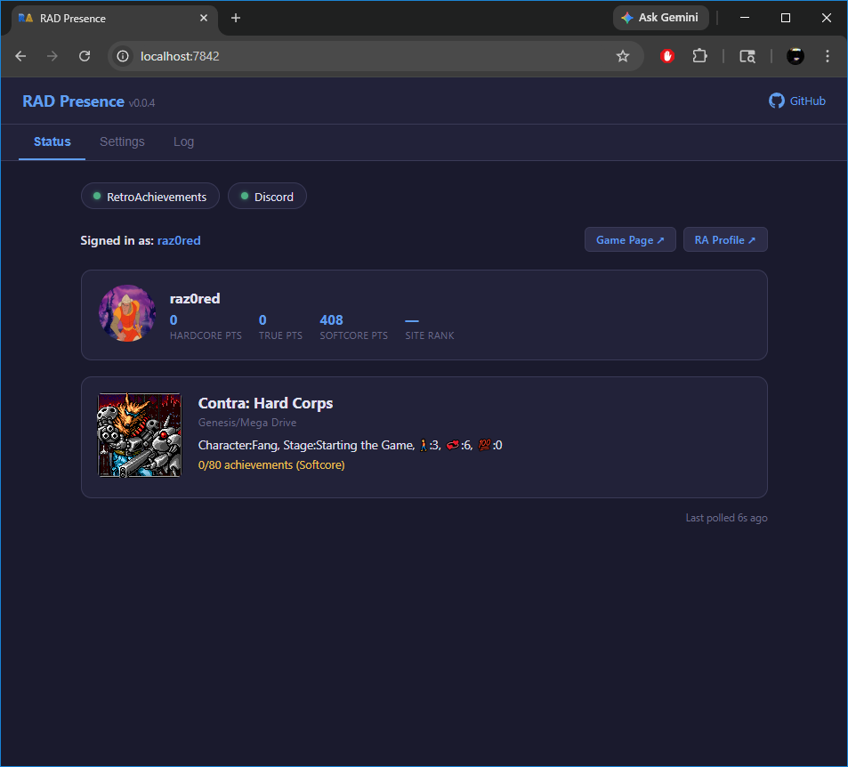
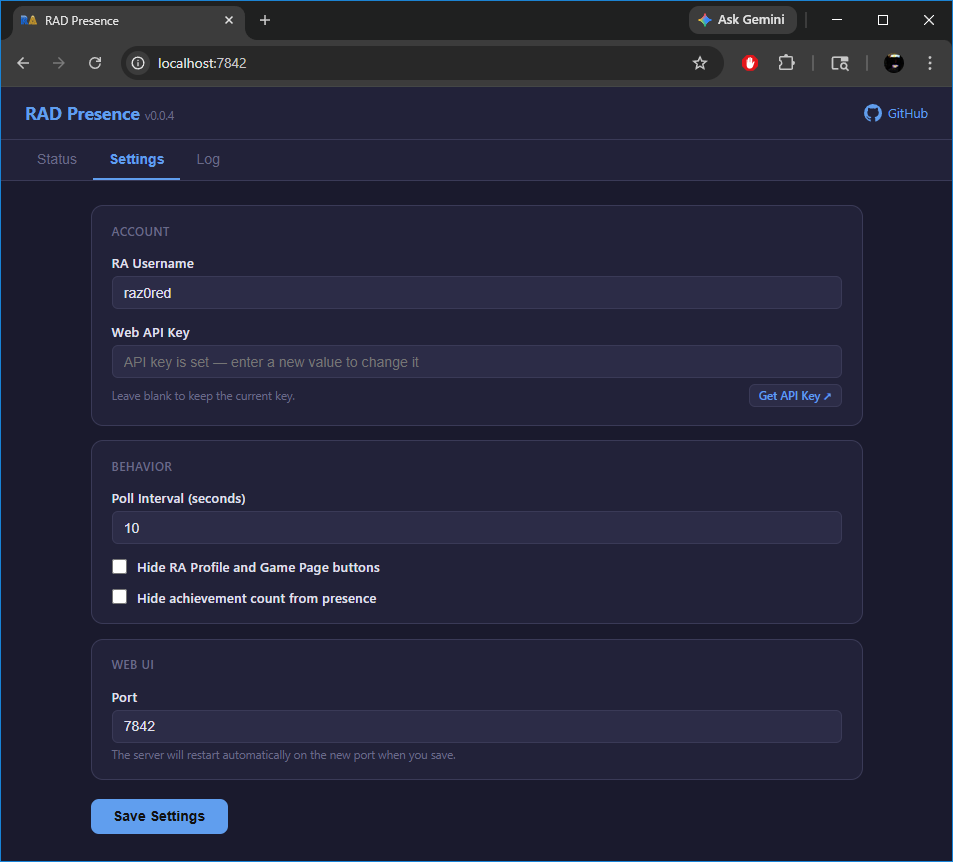
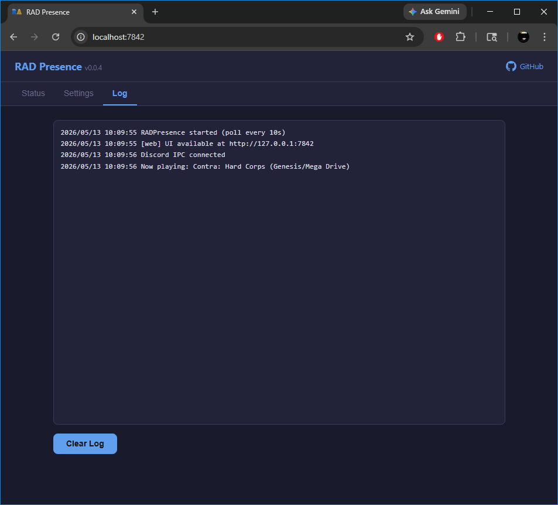

# RAD Presence

**RAD Presence** = RetroAchievements Discord Rich Presence.

A background service that mirrors your [RetroAchievements](https://retroachievements.org/) session to [Discord Rich Presence](https://discord.com/developers/docs/rich-presence/overview).

Inspired by [CheevoPresence](https://github.com/denzi-gh/CheevoPresence) — reimagined in Go as a cross-platform background service with no UI dependencies and a single self-contained binary.


---

## Features

- Polls your RetroAchievements session every 10 seconds (configurable)
- Updates Discord with the game title, cover art, console, achievement progress, elapsed timer, and links to your RA profile and game page
- Clears presence automatically when you stop playing
- Runs as a native background service (Windows SCM / macOS launchd / Linux systemd) — starts on login, no interaction needed
- Single binary — no runtime, no installer, no dependencies
- Optional web UI for live status, log viewing, and settings — all without restarting the service

---

## Getting Started

### 1. Get your API key

Log in to [retroachievements.org](https://retroachievements.org/), go to **Settings → Web API Key**, and copy it.

### 2. Save your credentials

```
radpresence set --username YOUR_RA_USERNAME --apikey YOUR_API_KEY
```

### 3. Make sure Discord is running

The Discord desktop app must be running on the same machine and logged in to the account you want the Rich Presence posted to. RAD Presence communicates with Discord over a local IPC socket — it does not work with the browser version of Discord.

### 4. Test in the foreground first

```
radpresence run
```

Runs in the terminal and prints log output. Press Ctrl+C to stop. Verify your credentials and presence are working correctly before installing as a service.

### 5. Install as a background service (recommended)

RAD Presence is designed to run as a native OS service — it starts automatically on login, runs silently in the background, and requires no interaction. This is the recommended way to use it.

Place the binary somewhere permanent **before** running `install` — the service is registered to its location at install time. Suggested locations:

| Platform | Suggested location |
|---|---|
| Windows | `C:\Program Files\RADPresence\radpresence.exe` |
| macOS | `/usr/local/bin/radpresence` |
| Linux | `~/.local/bin/radpresence` or `/usr/local/bin/radpresence` |

```
# Windows — run as Administrator
radpresence install
radpresence start

# macOS — no sudo needed (installs a LaunchAgent in ~/Library/LaunchAgents)
radpresence install
radpresence start

# Linux — no sudo needed (installs a systemd user service)
radpresence install
radpresence start
```

Once installed, it will start automatically on every login — no further action needed.

### Updating to a new version

1. Stop the service: `radpresence stop`
2. Replace the binary in place with the new one
3. Start the service: `radpresence start`

If you move the binary to a different path, run `radpresence uninstall` first, move it, then `radpresence install` and `radpresence start` again.

---

## All Commands

| Command | Description |
|---|---|
| `radpresence set --username X --apikey Y` | Save credentials to config |
| `radpresence set --interval 30` | Change the poll interval (seconds) |
| `radpresence set --hide-buttons` | Hide RA Profile and Game Page buttons from presence |
| `radpresence set --hide-buttons=false` | Re-enable buttons |
| `radpresence set --hide-achievements` | Hide achievement count from presence |
| `radpresence set --hide-achievements=false` | Re-enable achievement count |
| `radpresence set --web-ui` | Enable the web UI |
| `radpresence set --web-ui=false` | Disable the web UI |
| `radpresence set --web-port 8080` | Set the web UI port |
| `radpresence set` | Show current config |
| `radpresence run` | Run in the foreground, Ctrl+C to stop |
| `radpresence run --username X --apikey Y` | Run with inline credentials (no saved config needed) |
| `radpresence open` | Open the web UI in your default browser |
| `radpresence install` | Register as a system service |
| `radpresence uninstall` | Remove the system service |
| `radpresence start` | Start the installed service |
| `radpresence stop` | Stop the running service |
| `radpresence status` | Show service status |
| `radpresence version` | Print version information |

---

## Building from Source

Requires [Docker](https://www.docker.com/) and [Task](https://taskfile.dev).

### Build Tasks

| Task | Description |
|---|---|
| `task build` | All platforms (Windows, Linux, macOS amd64 + arm64) |
| `task build:windows` | Windows amd64 only |
| `task build:linux` | Linux amd64 only |
| `task build:mac` | macOS amd64 + arm64 only |

Binaries are written to `dist/`.

### Dev Tasks

| Task | Description |
|---|---|
| `task fmt` | Auto-format all Go source files |
| `task fix` | Auto-format and apply golangci-lint auto-fixes |
| `task vet` | Run `go vet` |
| `task lint` | Run `golangci-lint` |
| `task validate` | Format + vet + lint (run before pushing) |
| `task clean` | Remove `dist/` |

---

## Config File Location

| Platform | Path |
|---|---|
| Windows | `%APPDATA%\RADPresence\config.json` |
| macOS | `~/Library/Application Support/RADPresence/config.json` |
| Linux | `~/.config/RADPresence/config.json` |

> **Note:** The API key is currently stored in the config file in plain text. Keyring integration (Windows Credential Manager, macOS Keychain, libsecret) is planned.

---

## Web UI

RAD Presence includes an optional browser-based UI that gives you a live view of your session, a real-time log, and full settings control — all without restarting the service.

### Enabling

```
radpresence set --web-ui
```

Then either restart the service, or if you're running in the foreground with `radpresence run`, the server starts automatically on the next poll cycle. Open it in your browser with:

```
radpresence open
```

Or navigate to `http://127.0.0.1:7842` directly. The UI binds to `127.0.0.1` only and is never accessible from other machines.

### Status Tab



The Status tab shows a live view of your current session, updated every 3 seconds. At the top, connection badges indicate whether RAD Presence is successfully talking to both RetroAchievements and Discord. Below that, your user profile card shows your avatar, username, point totals (hardcore, true, and softcore), and your site rank — clicking the card opens your RA profile. When you are actively playing, a game card appears showing the cover art, game title, console, rich presence message, and current achievement progress — clicking it opens the game's RA page.

If your credentials are invalid or the RA API cannot be reached, a red banner appears with a plain-English explanation and a direct link to the Settings tab.

### Settings Tab



The Settings tab lets you change any option without touching the command line. All changes (except port) take effect on the next poll cycle with no service restart required. Credentials are validated against the RA API before being saved — if the username or key is wrong, the save is rejected and a toast notification explains the problem. Changing the web UI port restarts the server automatically and redirects your browser to the new address.

### Log Tab



The Log tab shows a scrolling view of the last 500 log lines from the running service, colour-coded by severity (errors in red, warnings in amber). It refreshes every 3 seconds while the tab is open. The **Clear Log** button wipes the in-memory buffer immediately.

### Web UI Commands

| Command | Description |
|---|---|
| `radpresence set --web-ui` | Enable the web UI |
| `radpresence set --web-ui=false` | Disable the web UI |
| `radpresence set --web-port 8080` | Change the port (default: 7842) |
| `radpresence open` | Open the web UI in your default browser |

> All settings — including credentials, poll interval, and port — can be changed live from the web UI or via `radpresence set` while the service is running. No restart is needed.

---

## Credits

Inspired by [CheevoPresence](https://github.com/denzi-gh/CheevoPresence) by [denzi_gh](https://github.com/denzi-gh).
